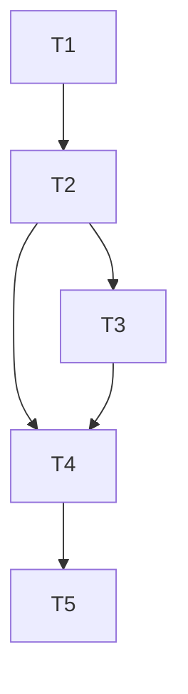

## Dependency Graph

## 1. Spec And Configuration Foundations

- [ ] 1.1 (T1) Confirm the OpenSpec delta and repository fixtures cover the new exclude-list behavior expected for `camellia`.
depends_on: []

- [ ] 1.2 (T2) Extend plugin settings decoding and analyzer construction so `camellia` accepts an `exclude` list, validates patterns during initialization, and builds a configured analyzer instance.
depends_on: [T1]

## 2. Exclusion Matching

- [ ] 2.1 (T3) Implement module-root-relative path normalization and exclude matching, including bare-directory recursive behavior and `**` glob support for analyzed files.
depends_on: [T2]

- [ ] 2.2 (T4) Add regression coverage for zero-config behavior, excluded files, excluded directories, equivalent bare-directory and `/**` behavior, and malformed patterns.
depends_on: [T2, T3]

## 3. Validation

- [ ] 3.1 (T5) Validate the change with repo-local Go caches by running tests, rebuilding the custom `golangci-lint` binary, and smoke-testing that only `camellia` honors the new excludes.
depends_on: [T4]
