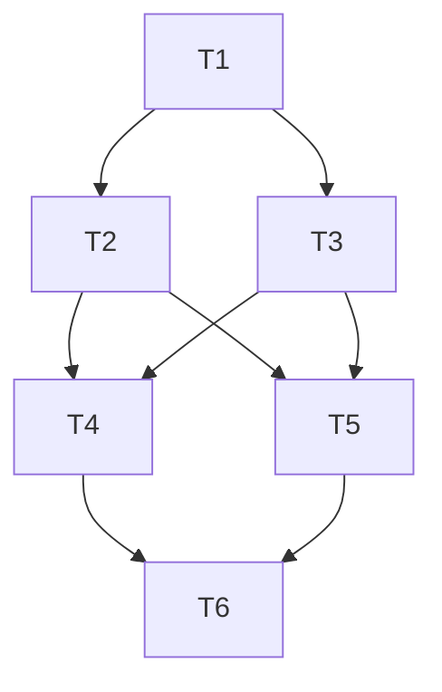

## Dependency Graph

## 1. Analyzer Foundations

- [x] 1.1 (T1) Add the custom analyzer package skeleton, helper functions for abbreviation normalization, and the repository dependencies needed for `go/analysis` and golangci plugin integration.
depends_on: []

- [x] 1.2 (T2) Implement declaration collection and project-code filtering so the analyzer checks all project-defined identifier declarations while excluding imported and library symbols.
depends_on: [T1]

- [x] 1.3 (T3) Implement strict no-exception abbreviation detection and diagnostic messages that include the corrected camel-case replacement name.
depends_on: [T1]

## 2. Lint Integration And Coverage

- [x] 2.1 (T4) Register the analyzer through golangci-lint's module plugin system and add repository configuration so the custom rule runs in the normal lint workflow.
depends_on: [T2, T3]

- [x] 2.2 (T5) Add regression tests covering valid and invalid names across declaration kinds, test files, and imported-library exclusions.
depends_on: [T2, T3]

## 3. Verification

- [x] 3.1 (T6) Verify the implementation by running Go tests and the repository's golangci-lint workflow, then document any required usage notes discovered during validation.
depends_on: [T4, T5]
